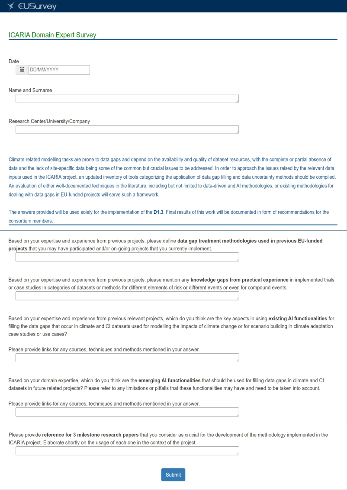

# <u> ICARIA’s domain user survey </u>
 
## The main objective of the survey

The development of ICARIA's holistic model aligns with current SOTA methodologies, focusing on identifying risk/impact assessment strategies from a multi-hazard perspective and considering all climate-hazard categories, (including heatwaves, forest fires, droughts, floods, storm surges, and storm winds), covering complex, compound, and cascading events. However, accessing the replicability and capabilities of the holistic model remains the ultimate target. To achieve this, case study areas, namely the Barcelona Metropolitan Area, South Aegean Region, and Salzburg Region were subjected to combined climate-hazard events. This practical exposure allowed experts to concurrently assess and identify modeling gaps and uncertainties during the data collection phase. Subsequently, experts could unravel the correlations between impact/risk assessment methodologies, case study areas, and modeling requirements. While this approach provides a robust foundation for creating and applying the holistic model, the complementary input from experts regarding data gaps associated with data-driven methodologies remains crucial. This input is sought to address potential expansions and modifications of the chosen methodologies. The domain user survey serves exactly this complementary role, gathering answers from a panel of ten (10) experts (internally or externally to the consortium). Their expertise and experience in local and/or EU-funded projects guide an assessment of the latest state-of-the-art methodologies present in data-gaps treatment methodologies and data-driven techniques. The survey is structured following a systematic approach, commencing with the treatment of data gaps identified in previous projects where experts actively participated. This information is key, helping in recognizing recurring patterns of data gaps that may be shared across ICARIA and related projects, guiding case facilitators towards an extensive understanding of methodologies appropriate for addressing data gaps and uncertainties. Subsequently, as a second step, experts are prompted to identify potential knowledge gaps based on their practical experience. This aspect proves valuable in the analysis of both single and compound or cascading scenarios from local authorities and case facilitators, identifying vulnerabilities within specific risk categories. Further, an additional key point of the survey is the evaluation of the functionality and applicability of existing and emerging AI methodologies, specializing in utilizing AI to treat data gaps and address uncertainties within climate and CI datasets when modeling climate adaptation studies, mirroring the use cases of ICARIA. Lastly, experts are asked to provide references to milestone papers that may or may not play a crucial role in the integration of data gap treatment methodologies with AI techniques, potentially extending to areas such as climate data. This inclusion ensures that ICARIA remains aligned with the latest SOTA approaches.List of experts

A brief list of the experts and a description of the range of the topics are covered based on their background and expertise. While climate resilience remains the main object in the ICARIA project, diverse backgrounds of experts create a whole picture of the current practices for data-driven/AI-based methodologies (when applied to climate data or otherwise). The following list of ten (10) experts including their backgrounds and specialties can be found in Table #.

|<table>  <thead> <tr>  
<tr>  <th> Name </th> <th> Institution </th>  <th> Expertise </th>  <th> Inter-/External </th>  </tr>  </thead>  <tbody>  
<tr> <td> Robert Monjo i Agut </td>  <td> [FIC](https://ficlima.org/) </td>  <td><code> Climate statistical downscaling and weather data </code></td>  <td><code> Internal </code></td> </tr>
<tr> <td> V </td>  <td> Detailed z </td>  <td><code>Data </code></td>  <td><code> CFs </code></td> </tr>
<tr> <td> V </td>  <td> Detailed z </td>  <td><code>Data </code></td>  <td><code> CFs </code></td> </tr>
<tr> <td> V </td>  <td> Detailed z </td>  <td><code>Data </code></td>  <td><code> CFs </code></td> </tr>
<tr> <td> V </td>  <td> Detailed z </td>  <td><code>Data </code></td>  <td><code> CFs </code></td> </tr>
<tr> <td> V </td>  <td> Detailed z </td>  <td><code>Data </code></td>  <td><code> CFs </code></td> </tr>
<tr> <td> V </td>  <td> Detailed z </td>  <td><code>Data </code></td>  <td><code> CFs </code></td> </tr>
<tr> <td> V </td>  <td> Detailed z </td>  <td><code>Data </code></td>  <td><code> CFs </code></td> </tr>
<tr> <td> V </td>  <td> Detailed z </td>  <td><code>Data </code></td>  <td><code> CFs </code></td> </tr>
<tr> <td> V </td>  <td> Detailed z </td>  <td><code>Data </code></td>  <td><code> CFs </code></td> </tr>
</tbody>  </table> |

Experts’ background spans a diverse pool of subjects, encompassing methodologies including but not limited to EO, RS, statistical and dynamical downscaling techniques, along with methodologies for DL, AI applied to climate resilience, and a range of other domains. Although the initial emphasis was placed on updating internal expertise, the participation of external specialists is equally indispensable in achieving the purpose of compiling lists of state-of-the-art emerging data-driven methodologies, particularly when integrated with insights from user studies. For the survey purposes, the EU Survey portal was used to initiate, create, publish, and collect the results of the survey. This portal offers a unique, user-friendly UI that intuitively guides the users through the creation of a survey, providing a plethora of options in terms of the structure of the survey. The link to the survey is provided in this link: [https://ec.europa.eu/eusurvey/runner/f96af3c2-67bc-11df-2c43-f5f6b97351cd](https://ec.europa.eu/eusurvey/runner/f96af3c2-67bc-11df-2c43-f5f6b97351cd). A figure of the survey as can be found in the EU survey’s dedicated web interface can be find below:

  

## Overview of the survey
A summary of the results, and a brief description of the key methodologies proposed, as well as the output of the survey will be added below.

## Summary of the Survey

The summary of the domain user survey for data gap treatment methodologies, knowledge gaps from practical experience, and AI functionalities can be organized in three lines: (1) Data gap treatment, (2) Existing AI functionalities, and (3) Emerging AI functionalities. The list of the experts who participated in the survey shared their extensive experience in participating in previous and current EU-funded projects and highlighted data inhomogeneity and inconsistency as the main issues to be addressed. For that reason, methodologies such as interpolation, value data gap filling, and inhomogeneity tests were proposed. Additionally, it was underlined that high-resolution meteorological forecasts and Copernicus ERA-5 reanalysis data are critical for training machine learning models, though varying quality standards can impact forecasting accuracy. This is only an example of the utilization of machine learning and AI methodologies for climate change.  In terms of AI functionalities, current AI capabilities include temporal and spatial auto-correlation, climate projections and simulations, domain adaptation models, non-stationarity, and the use of spatiotemporal masked autoencoders as key candidate methodologies to improve resilience to data gaps. This is reflected in the ICARIA project and has the potential to be linked with the climate change and hazard data for cases where weather data are in scarcity (e.g. not fully covering the studied area or when weather observations are not reaching the minimum years necessary for providing accurate and robust output). Further, improving climate change methodologies using AI tools, should include a list of emerging methods including, domain adaptation models, extrapolation AI methods such as Generative Adversarial Neural Networks (GANs), Diffusion models, self-supervised learning, physics-aware models, and self-supervised pre-training, creation of machine learning-based emulators of physical purposes. These methodologies allow for further investigation and application through ICARIA's lab tests and trials and mini-trials, allowing for inclusion of the suggestions from experts, utilizing concrete tools developed in previous EU-funded and other various related projects. The diversity of the experts allows for creating a more complete idea of the applicability of AI tools, and how realistic such tools would be for ICARIA's purposes.

