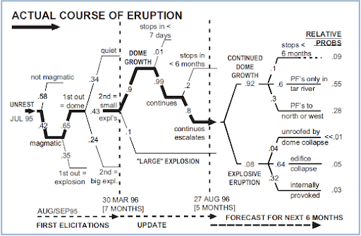
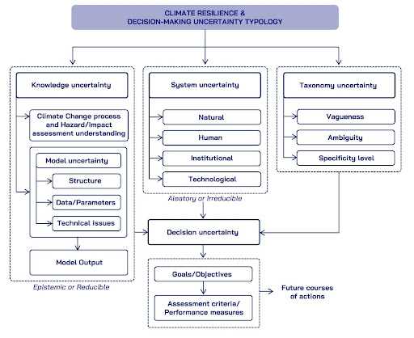

# Methodologies for data-gap filling and uncertainties treatment 

## Main methodologies in ICARIA Cookbook 

The ICARIA Cookbook provides a series of “*recipes*” that include references and technical specifications to address data-gaps and uncertainties with respect to the ICARIA Holistic modelling framework. The main methods used in ICARIA, widely consolidated in literature, are summarized in the following.

## Statistical and dynamical methods

When talking about the generation of climate information in ICARIA, one of the main concerns that both climate scientists (as information providers) and sectoral partners or decision-makers (as information receivers) have to deal with is the inherent uncertainty of climate data3,4. Global Climate Models (GCMs), are numerical models that represent the climate system with varying degrees of complexity and are based on the physical, chemical and biological properties of its components, their interactions and feedback processes. Each GCM represents all components of the earth system (atmosphere, cryosphere, biosphere, ocean, ice-sheets), as well as human impacts via greenhouse gas emissions and simulates possible future climate states. By representing all components, also their interactions are depicted (e.g., melting of sea ice changes the ocean’s salinity and albedo, in turn affecting ocean’s temperature, which then affects the atmospheric temperature). These models provide important information, however, their spatial resolution is relatively coarse (e.g., 100 km x 100 km, meaning 1 temperature, precipitation etc. value for a grid box of 10.000km²). To address this limitation, downscaling techniques are employed. In this sense, ICARIA has tried to tackle this uncertainty by not sticking to one but <u> considering the two main sources of generation of information at the local scale available: dynamical and statistical downscaling </u>. ICARIA has incorporated into its procedures these two downscaling methods.

<span style="text-decoration: underline">Statistical downscaling</span> obtains empirical relationships between large-scale variables from GCMs and high-resolution (surface) variables, allowing us to obtain very local results (like in a village) with less error than the dynamical one. The statistical downscaling methodology applied in ICARIA by FIC, named FICLIMA ({cite:p}`Ribalaygua2013`), consists of a two-step analogue/regression statistical method which has been used in national and international projects with good verification results. The first step is common for all simulated climate variables and it is based on an analogue stratification. For the second step, the procedures applied depend on the variable of interest, ranging from multiple linear regression in temperature, clustering of rainfall most analogous days for precipitation, or transfer functions between probability distributions and parametric bias corrections for wind or RH. This methodology was applied in ICARIA for the three case studies using 10 GCMs and the 4 Tier 1 Shared Socioeconomic Pathways (SSPs) (1-2.6, 2-4.5, 3-7.0 and 5-8.5).

<u> Dynamical downscaling </u>, on the other hand, increases the resolution of the GCMs over the region of interest with RCMs, taking into account local characteristics and altering physical processes, allowing us to obtain results in areas (like watersheds) where there are no observed data as well as a better representation of atmospheric processes. For the so-called GCM to better represent local features such as topography or land use, the output of the general circulation models is used to drive regional climate models. Regional climate models represent atmospheric processes at spatial resolutions of ~1-12 km. This so-called dynamical downscaling was applied within ICARIA for 2 SSP scenarios (SSP126, SSP585), using two kinds of regional climate models (Weather Research and Forecasting Model (WRF) and Consortium for Small-scale modelling (COSMO) for Salzburg and South Aegean region. 

On the other hand, there’s the uncertainty problem about climate information. Efforts within the scientific community focus on addressing and quantifying uncertainties in climate simulations. Within climate projections two kinds of uncertainties are discussed, first the scenario uncertainty, and second the model uncertainty. The first one relates to the fact that we don’t know which emission scenario will become reality until 2100, thus the temperature evolution until the end of the century is uncertain, but within the simulated ranges (low to high emissions). The latter represents the fact that for the same emission scenario, two models might yield opposing trends, which is the case for precipitation. As highly complex processes of different temporal and spatial scales are at play for precipitation, its correct representation within climate models is still subject of research. Even though we already know a lot, the approaches taken within two different models might cause opposing trends of precipitation amounts until 2100. Within ICARIA, each downscaling methodology assesses its own uncertainty with inner processes of verification through the use of different procedures and statistics, ensuring that the methodology introduces the least amount of uncertainty into the outcomes. As a result, both methods are then combined following the ensemble strategy, displaying the different outcomes and impacts for future climate states. Often the medians and quantiles are applied to gain a better knowledge and reduce uncertainty, enhancing the understanding of future climates for specific locations.

## Data-driven and data fusion methodologies 

Data-driven methodologies offer an additional tool for climate resilience and especially for defining, estimating, and treating data gaps ({cite:p}`harder2024hardconstrained` {cite:p}`Reichstein2019` {cite:p}`andrychowicz2023deep`). While it finds application in a majority of fields, the ICARIA project and D1.3, include data-driven methods for studying data gaps for climate resilience. These methods guide us in filling data gaps in time series forecasting at large scales, in addressing weather data, in expanding hazard datasets by combining input from inventories (e.g. before and after an extreme event), in enhancing large-scale quantitative hazard assessments, etc.. Further, the integration of public data with asset characteristics (e.g., buildings), helps to estimate and generate representative values for characteristics when data gaps appear, providing key input for improving critical response strategies and risk assessments from regional to national scales. Data-driven methodologies can play a key role as an auxiliary tool for data-gaps treatment while additionally providing complementary information to real-world experiments, filling geospatial data gaps about infrastructure, and expanding the output of climate models.

## Expert elicitation methods 

Expert elicitation is a structured procedure for obtaining uncertainty judgments from experts, measuring their individual judgment capabilities with a performance-based metric, and then applying mathematical scoring rules to combine these individual judgments into a ‘_rational consensus_’ that can inform the deliberations of policy-makers. One of the most widely adopted elicitation methods is the “_classical model_” formulated by Cooke ({cite:p}`cookbook`). The classical model has been developed to aggregate expert judgments based on performance measures, and is based on the scoring of expert judgment in terms of statistical accuracy and informativeness. The statistical accuracy, representing the “_calibration_” of expert's opinion, is tested through a number of questions for which the answer can be confronted with observed values and expressed by a probability index (the so called “*seed variables*”, whose value is known to the analysts at the moment of the elicitation but are not known to the experts at the moment of the elicitation). Experts are thus scored according to their performance in assessing seed variables. A low value (near zero) expresses a high accuracy. The product of statistical accuracy and informativeness for each expert is their combined score, expressed as Performance Weighted (PW) combinations. Other assessment values can be derived from elicitation, such as Equally Weighted (EW) or Harmonically Weighted (HW) combinations, as well as individual expert assessments.



Simplified volcanic eruptive scenario event tree, incorporating probabilities of occurrence of different eruptive events derived from successive expert elicitations ({cite:p}`mader`). Probabilities of hazard transitions are derived from expert elicitation using the Cooke classical method.

The application of expert elicitation methods is particularly appropriate to determine target variables characterized by significant level of uncertainty, which cannot be sufficiently described using current models or field data, but for which a rational consensus among experts can be reached. Based on the Cooke’s classical model, several expert elicitation approaches and supporting tools have been developed, and are characterized by the following common features: 
 * Scrutability: All data and processing tools are open to peer review and results must be reproducible by competent reviewers. 
 * Empirical control: Quantitative expert assessments are subjected to quality controls. 
 * Neutrality: The method for evaluating expert opinions should encourage experts to state their true opinions. 
Fairness: Expert opinions are not judged, prior to processing the results of their assessments.

## Uncertainty treatment methods 

The Climate-ADAPT <u> ({cite:p}`ZUCCARO2018199`) uncertainty guidance</u> highlights the many levels of uncertainties associated to climate change impacts and adaptation: Future emissions trajectories of greenhouse gases and aerosols, which are influenced by demographic, economic, and technological developments and international climate agreements, will determine the scale and speed of future climate change. The impact of climate change on the environment and society will be shaped by the future development of non-climatic factors, including socio-economic, demographic, technological, and environmental changes. Measurement errors arise from using imperfect observational tools, such as rain gauges, and from data processing methods, like algorithms for estimating surface temperatures from satellite data. Aggregation errors occur due to incomplete temporal and spatial data coverage. Natural variability is driven by unpredictable processes within the climate system, such as atmospheric and oceanic changes, future volcanic eruptions, and dynamics within climate-sensitive environmental and social systems, like ecosystems. Model limitations in climate and impact models stem from their limited resolution, which affects the detailed representation of phenomena like cloud physics, and from an incomplete understanding of individual Earth system components, such as dynamic ice sheets, their interactions and feedbacks, like climate-carbon cycle feedbacks, and environmental or social systems under study, such as demographic changes in flood-prone areas or specific urban morphologies and features of building, open spaces and vegetative cover that affect soil drainage capacities and urban heat island conditions. Lastly, societal preferences and political priorities influence the significance placed on specific climate impacts, such as local or regional biodiversity loss.



Climate resilience & Decision-making uncertainty Typology based on knowledge uncertainty, system system uncertainty, taxonomy uncertainty, and decision uncertainty (modified after {cite:p}`ASCOUGH2008383`).

These types of uncertainties can be connected to various areas of “_Knowledge Uncertainty_”, “_Variability Uncertainty_” and “_Decision Uncertainty_”, as defined by Walker et al. (2003) ({cite:p}`doi:10.1076/iaij.4.1.5.16466`), which lead to the necessity of considering uncertainty as essential component of decision-making for climate resilience. According to Street and Nilsson (2014) ({cite:p}`Street2014`), recognizing and reflecting the nature and characteristics of uncertainty in the use of evidence leads to better-informed, more relevant, and robust decisions. By acknowledging uncertainties instead of expecting clear-cut outcomes, uncertainties become more manageable, enabling the formulation of coherent decisions and policies. Furthermore, the acknowledgment of uncertainties in hazard/impact assessments contribute to minimizing the risk of maladaptation and to a more effective risk management. In particular, the focus of ICARIA on probabilistic assessment of complex events (compound coincident, compound consecutive, cascading effects, see _D1.1_), which requires articulated event tree analysis, whose uncertainties in terms of hazard transition probabilities, and/or in terms of likelihood of cascading effects given a certain damage threshold on critical service assets and networks ({cite:p}`ZUCCARO2018199`), may lead to propagation of error in the impact assessment. 

<u> Ensemble strategy for ICARIA climate information </u> 
In the generation of climate information for ICARIA, one of the primary challenges faced by climate scientists and decision-makers is the inherent uncertainty in climate data 
({cite:p}`Camps2023`, {cite:p}`ClimateTipping2023`). Climate Models (CMs) are numerical models that represent the climate system with varying degrees of complexity, each simulating past and future climate states uniquely, thus introducing a degree of uncertainty based on the selected CM. The climate system itself has inherent variability due to the different time scales of its components (e.g., atmospheric processes occur over days, oceanic processes over years) and their impacts on weather patterns and phenomena like ENSO or AMO. While CMs effectively simulate broad atmospheric circulation, they lack the resolution (around 100 km) for capturing smaller-scale local phenomena, necessitating downscaling techniques that further add uncertainty. Additionally, the emission scenarios (SSPs) used to drive future climate projections introduce another layer of complexity and uncertainty in interpreting and communicating model results and their local impacts.

The scientific community addresses and quantifies uncertainties in climate simulations primarily through the ensemble strategy ({cite:p}`ZUCCARO2018199`), which involves using different models to compute the same SSP scenario. This approach displays various outcomes and impacts for future climate states, highlighting the spread within model simulations and enhancing the understanding of future climates for specific locations. Different procedures ({cite:p}`WILCKE2016191`) can further reduce uncertainty from ensemble outcomes, such as selecting different ranges of change.

ICARIA tackles this uncertainty not only through the ensemble approach but also by utilizing both dynamical and statistical downscaling methods. Each method assesses its own uncertainty through verification processes using different procedures and statistics, ensuring minimal uncertainty is introduced into the outcomes. By combining these two approaches, ICARIA gains a broader perspective, assessing uncertainties and their implications for future projections. This dual-method approach allows for a better representation of variability and possible future states while being time efficient. Consistent results from both methodologies at the same location enhance the reliability of ICARIA’s climate outcomes, providing trustworthy information for case studies and other partners. Conversely, significant differences between the methodologies indicate high uncertainty in future states, dependent on the model used.

Once the results from both downscaling methodologies were delivered in *D1.2*, ICARIA established its ensemble strategy for handling all climate information produced in WP1. This strategy addresses the primary type of uncertainty inherent in the project: the climate information itself.

The ensemble strategy used is derived from the RESCCUE ({cite:p}`w10101356`) project. It goes beyond simply using SSPs for CMIP6 by incorporating an impact approach. This approach considers the expected changes for a variable from all potential future scenarios, thereby accounting for uncertainties from downscaling methods, unknown socioeconomic evolutions, and the inherent variability and divergence in climate models.

The first step involves analyzing projections related to main variables and hazard indicators for impact modelling. All scenarios (combinations of GCM + SSP) from both downscaling methodologies are considered as an ensemble, resulting in 48 total scenarios for SLZ and SAR (40 from statistical and 8 from dynamical), and 40 for AMB (only statistical). 
These scenarios are ordered based on expected changes relative to the climate baseline (1981-2020) for future climate periods. 
An impact approach is then used to identify the “*most probable scenario*” (P50, or median) and the “*worst-case scenario*” (P90). The scenarios in the ensemble strategy are traceable, allowing identification of the specific scenario selected (e.g., the most-probable scenario P50 for TMax corresponds to model MPI-ESM2-1-HR and projection SSP3-7.0). 
By comparing the "worst-case scenario" (P90) with the median, the spread of results can be assessed, determining whether further measures are needed or if there is consensus in the projections. This ensures coherence and consistency when handling this type of data.

By proceeding in this manner, uncertainty in the evolution of socioeconomic scenarios is accounted for. Since it is unknown which SSP pathway humanity will follow, it is advisable not to rely on a single SSP. Instead, all SSPs are gathered, and the appropriate one is selected. This approach allows for flexibility, as humanity might not follow, for example, SSP 3-7.0 precisely, but another close scenario with similar results might be more accurate at some point. The selected scenarios will then be used for impact modelling, considering the expected evolution of changes in variables.

For compound events in ICARIA, joint probability in hazard modelling is resolved similarly. All scenarios for each variable in the compound event are considered. The same model+SSP combination for each variable is selected to maintain the inner dynamics of the climate model. Joint probabilities are obtained and sorted by their probability of occurrence, ultimately selecting the median (most likely scenario) and P90 (for uncertainty assessment).


In ICARIA, two methods for the evaluation of the uncertainties connected to the compound events and cascading effects timelines are suggested: (1) <u> Bayesian methods </u>, and (2) <u> Expert Elicitation methods </u> (see also above).

### Bayesian methods in uncertainty treatment 

Statistics consists of two main competing schools of thought: The frequentist or classical approach to statistical inference (which includes hypothesis testing and confidence intervals), and the Bayesian approach.
The underlying difference between the Bayesian and frequentist approaches to statistical inference is in the definition of probability. A frequentist views probability as a long-run frequency. When a frequentist asserts that the probability of a fair coin tossed landing heads is 1/2, he means that in the long run, over repeated tosses, the coin will land heads half the time. In contrast, a Bayesian, who will also surely say that the probability a coin lands heads is 1/2, is expressing a degree of belief that the coin lands heads, perhaps arguing that based on the symmetry of the coin there is no reason to think that one side is more likely to come up than the other side. This definition of probability is usually termed subjective probability. Whereas, in practice, a frequentist uses probability to express the frequency of certain types of data to occur over repeated trials, a Bayesian uses probability to express belief in a statement about unknown quantities" ({cite:p}`Glickman2007`).
At the base of Bayesian Analysis, there is the Bayes' rule. For two events A and B, having probabilities P(A) and P(B), respectively, the conditional probability, of A given B, P(A | B),  can be assessed through the Bayes' rule:

```{math}
P(A | B) = P(A) ∙ P(B | A) / P(B)
```
It is just a way of converting a probability like P(B | A) into one like P(A | B), that is, the probability that B occurs given A has occurred to the probability that A occurs given B.
In this formulation, P(A) is called the prior probability and P(B | A) is called the likelihood. P(B) is called the normalization factor. Bayes’ rule can be extended for random variables and their distribution functions in a straightforward way. It can be used to combine a prior distribution and a likelihood function to produce a posterior distribution. The posterior distribution might then be used as an input in a risk analysis15. We can write Bayes’ rule as:

```{math}
P(θ| E) = P(θ) P(E | θ) / P(E)
```

where P denotes probability mass (or density), $θ$ is a value of the random variable in question (for example the magnitude of the Hazard Hi) and E denotes the evidence being considered (for example, a triggering event TH of assigned magnitude). $P(θ)$ is the prior probability that the random variable takes on the value $θ$. Because $P(θ)$ is a distribution of $θ$, its integral with respect to θ is one. $P(E|θ)$ is the conditional likelihood function that expresses the probability of the evidence given a particular value of $θ$. The likelihood function is the probability of observing a value if the value were actually $θ$, interpreted as a function of $θ$. It is not a distribution, so its integral need not be one. The normalizing factor P(E) corresponds to the probability of having obtained the observed evidence. This divisor is the sum (or integral) with respect to $θ$ of the product of the prior and the likelihood. Bayes’ rule is applied for all values of $θ$ to obtain $P(θ|E)$, which is the posterior distribution of $θ$ given the evidence. Both the prior and the likelihood are functions of $θ$, and Bayes’ rule for distributions is essentially their product for each possible value of $θ$. The normalizing factor is not a function of $θ$, but has a single value such that the resulting posterior distribution integrates to unity.
For most Bayesians, the prior distribution is derived from the opinions or beliefs of the analyst. It is intended to represent, at least initially, the analyst’s subjective knowledge before any specific evidence is considered. Thus, it may be the result of amorphous preconceptions, mechanistic reasoning, hearsay, or some combination of these things. The likelihood function represents a model, also perhaps taken from the subjective knowledge of the analyst, of what data implies about the variable in question. The normalizing factor is often difficult to compute analytically, but the use of conjugate pairs may greatly simplify the problem. When these computational shortcuts can’t be used, recently developed software programs may be able to solve the problem using computer-intensive methods.
In synthesis, a typical Bayesian analysis can be outlined in the following steps ({cite:p}`Glickman2007`):
 - Formulate a probability model for the data.
 - Decide on a prior distribution, which quantifies the uncertainty in the values of the unknown model parameters before the data are observed.
 - Observe the data, and construct the likelihood function based on the data and the probability model formulated in step 1. The likelihood is then combined with the prior distribution from step 2 to determine the posterior distribution, which quantifies the uncertainty in the values of the unknown model parameters after the data are observed.
 - Summarize important features of the posterior distribution, or calculate quantities of interest based on the posterior distribution. These quantities constitute statistical outputs, such as point estimates and intervals.

The main goal of a typical Bayesian statistical analysis is to obtain the posterior distribution of model parameters. The posterior distribution can best be understood as a weighted average between knowledge about the parameters before data is observed (which is represented by the prior distribution) and the information about the parameters contained in the observed data (which is represented by the likelihood function). From a Bayesian perspective, just about any inferential question can be answered through an appropriate analysis of the posterior distribution. Once the posterior distribution has been obtained, one can compute point and interval estimates of parameters, prediction inference for future data, and probabilistic evaluation of hypotheses. 

### Elicitation methods in uncertainty treatment 

Expert judgment is sought when substantial scientific uncertainty impacts on a decision process. Because there is uncertainty, the experts themselves are not certain and hence will typically not agree. Informally soliciting expert advice is not new. Structured expert judgment refers to an attempt to subject this process to transparent methodological rules, with the goal of treating expert judgments as scientific data in a formal decision process. The process by which experts come to agree is the scientific method itself ({cite:p}`doi:10.1080/1366987042000192237`).
A valid goal of structured elicitation is to quantify uncertainty, not remove it from the decision process.
The elicitation technique adopted in Snowball methodology is the “_classical model_” ({cite:p}`cookbook`). It is a structured procedure for obtaining uncertainty judgments from experts, measuring their individual judgment capabilities with a performance-based metric, and then applying mathematical scoring rules to combine these individual judgments into a ‘rational consensus’ that can inform the deliberations of policy-makers.
The Classical Model method relies on the use of proper scoring rules for weighting and combining expert judgments through statistical accuracy and information scores, measured on calibration variables (see Cooke, 1991 ({cite:p}`cookbook`)) , and operationalizes principles for rational consensus via a performance-based linear pooling or weighted averaging model. The weights are derived from experts' calibration and information scores, as measured on seed item calibration variables. Calibration variables serve a threefold purpose18:
 * to quantify experts’ performance as subjective probability assessors;
 * to enable performance-optimised combinations of expert distributions;
 * to evaluate and hopefully validate the combination of expert judgments.
 
The name ‘_Classical Model_’ derives from an analogy between calibration measurement and classical statistical hypothesis testing. In the Classical Model performance-based weights use two quantitative measures of competency: calibration and information. Calibration measures the statistical likelihood that a set of experimental results correspond, in a statistical sense, with the expert's assessments. Information measures the degree to which an expert's uncertainty distribution is concentrated.

Its main steps are the following:

 - A group of experts is selected.
 - Expressing views as elemental uncertainty distributions, experts assess a set of variables (‘_seed items_’), true values of which are known or become known post hoc.
 - Experts’ responses are scored with regard to statistical likelihood that distributions over the set of seed items correspond to the observed or measured results - and also scored by a measure of informativeness compared to uniform background distribution.
 - The two scores are combined to form a weight for each expert.
 - Experts are elicited individually regarding their uncertainty judgments in relation to questions of interest (the ‘_target items_’).
 - Performance-based or equal weights scores are applied to individual responses to obtain weighted pooling of uncertainty distribution for each target items.

